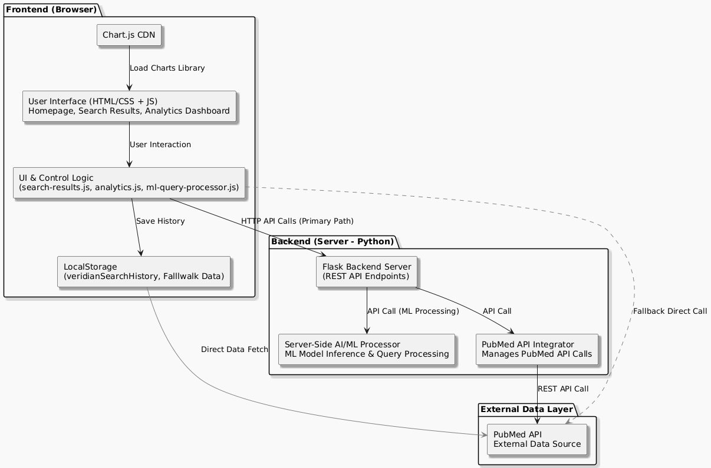

# 🔬 Veridian Research Platform

**AI-Enhanced Academic Research Discovery Platform**

Veridian is a sophisticated web-based research platform that leverages artificial intelligence and machine learning to enhance academic paper discovery and scientific literature search. The platform integrates with PubMed and provides intelligent search capabilities with a modern, responsive user interface.



## 🌟 Features

### 🔍 **AI-Powered Search**
- Machine learning-enhanced query processing
- Intelligent search result ranking
- Context-aware search suggestions
- Multi-source academic paper discovery

### 📊 **Analytics Dashboard**
- Real-time search analytics
- Query performance tracking
- Trending research topics
- User behavior insights

### 🎨 **Modern Interface**
- Responsive design for all devices
- Interactive particle background
- Smooth animations and transitions
- Dark/light theme support

### 🔬 **Academic Integration**
- PubMed API integration
- Enhanced research paper metadata
- Citation tracking
- Research trend analysis

## 🏗️ Architecture

```
Veridian Research Platform/
├── 🌐 Frontend (Web Interface)
│   ├── index.html              # Main landing page
│   ├── script.js               # Core JavaScript functionality
│   ├── style.css               # Styling and animations
│   └── assets/                 # Images and resources
│
├── 🐍 Backend (Python API)
│   └── search/
│       ├── backend/
│       │   ├── api_server.py           # Flask API server
│       │   ├── ml_query_processor.py   # ML query processing
│       │   ├── enhanced_pubmed_search.py # PubMed integration
│       │   ├── analytics_processor.py  # Analytics engine
│       │   └── requirements.txt        # Python dependencies
│       │
│       ├── data/               # Analytics and query data
│       └── docs/               # Backend documentation
│
├── 🚀 Scripts (Automation)
│   └── scripts/
│       ├── quick_start.bat         # Quick setup script
│       ├── run_complete_system.bat # Full system launcher
│       └── test_backend.bat        # Backend testing
│
└── 📁 Assets
    ├── logo.png                # Platform logo
    └── system-architext.png    # Architecture diagram
```

## 🚀 Quick Start

### Prerequisites
- **Python 3.7+** for the backend
- **Modern web browser** (Chrome, Firefox, Safari, Edge)
- **Internet connection** for PubMed API access

### Option 1: Automated Setup (Recommended)
```bash
# Clone or download the project
# Navigate to project directory
cd "project 6(nitin)"

# Run the complete system (Windows)
./RUN_ML_SEARCH_SYSTEM.bat

# Or use the quick start script
./scripts/quick_start.bat
```

### Option 2: Manual Setup

#### 1. Start the Backend Server
```bash
# Navigate to the backend directory
cd search/backend

# Install Python dependencies
pip install -r requirements.txt

# Start the API server
python api_server.py
```
*Server will be available at: `http://127.0.0.1:5000`*

#### 2. Launch the Frontend
```bash
# Open the main HTML file in your browser
# Or serve it with a local server (recommended):

# Using Python
python -m http.server 8080

# Using Node.js (if available)
npx http-server

# Using PHP (if available)
php -S localhost:8080
```
*Frontend will be available at: `http://localhost:8080`*

## 🔧 Configuration

### Backend Configuration
Edit `search/backend/api_server.py` to customize:
```python
# Server settings
HOST = '127.0.0.1'
PORT = 5000
DEBUG = True

# API rate limits
RATE_LIMIT = 100  # requests per minute

# Analytics storage
ANALYTICS_PATH = '../data/'
```

### Frontend Configuration  
Edit `script.js` to modify:
```javascript
// API endpoint
const API_BASE_URL = 'http://127.0.0.1:5000';

// Search settings
const SEARCH_DELAY = 300; // milliseconds
const MAX_SUGGESTIONS = 8;

// UI preferences
const ENABLE_ANIMATIONS = true;
const PARTICLE_COUNT = 100;
```

## 🎯 Usage Guide

### Basic Search
1. **Open the platform** in your web browser
2. **Enter your research query** in the search box
3. **Click search** or press Enter
4. **Browse enhanced results** with AI-powered relevance ranking

### Advanced Features
- **ML Suggestions**: Get intelligent query suggestions as you type
- **Analytics View**: Access `/analytics` to view search trends
- **API Access**: Use the REST API for programmatic access

### API Endpoints
```bash
# Health check
GET /health

# Enhanced search
POST /api/search/enhanced
{
  "query": "machine learning healthcare",
  "limit": 10,
  "filters": {...}
}

# Query processing
POST /api/ml/process-query
{
  "query": "diabetes treatment options"
}

# Analytics
GET /api/analytics/summary
GET /api/analytics/trending
```

## 📊 Analytics & Insights

The platform provides comprehensive analytics:
- **Search Volume**: Daily/hourly search statistics
- **Popular Queries**: Most searched terms
- **Performance Metrics**: Response times and success rates
- **Trend Analysis**: Emerging research topics

Access analytics through:
- **Web Interface**: Navigate to analytics page
- **API Endpoints**: Programmatic access to metrics
- **Data Files**: JSON exports in `search/data/`

## 🛠️ Development

### Project Structure Details
```bash
Frontend Files:
├── index.html          # Main landing page with search interface
├── script.js           # Core functionality and API integration
├── style.css           # Responsive styling and animations
└── assets/             # Static resources

Backend Components:
├── api_server.py       # Flask web server and REST API
├── ml_query_processor.py    # Machine learning query enhancement
├── enhanced_pubmed_search.py # PubMed integration and parsing
├── analytics_processor.py   # Analytics collection and processing
└── simple_api_server.py     # Lightweight API alternative

Data Storage:
├── ml_query_history.json    # ML query logs
├── analytics_data/          # User analytics
└── cache/                   # Search result caching
```

### Adding New Features

#### Backend (Python)
1. Add new endpoints in `api_server.py`
2. Implement logic in respective processor modules
3. Update `requirements.txt` if needed

#### Frontend (JavaScript)
1. Add new functions in `script.js`
2. Update UI elements in `index.html`
3. Style new components in `style.css`

### Testing
```bash
# Test backend health
curl http://127.0.0.1:5000/health

# Test search functionality
curl -X POST http://127.0.0.1:5000/api/search/enhanced \
  -H "Content-Type: application/json" \
  -d '{"query": "AI research", "limit": 5}'

# Run automated tests
python -m pytest search/tests/  # (if test suite exists)
```

## 🔒 Security & Performance

### Security Features
- **Input validation** on all API endpoints
- **CORS configuration** for cross-origin requests
- **Rate limiting** to prevent abuse
- **Secure data handling** for user queries

### Performance Optimizations
- **Async processing** for non-blocking operations
- **Result caching** to reduce API calls
- **Lazy loading** for large datasets
- **CDN integration** for static assets

## 📦 Dependencies

### Python Backend
```txt
flask>=2.3.0          # Web framework
flask-cors>=4.0.0     # Cross-origin requests
requests>=2.31.0      # HTTP client
python-dateutil>=2.8.0 # Date processing
```

### Frontend (CDN-loaded)
- **No build process required**
- All dependencies loaded from CDN
- Modern browser with ES6+ support

## 🐛 Troubleshooting

### Common Issues

#### Backend Won't Start
```bash
# Check Python version
python --version  # Should be 3.7+

# Install dependencies manually
pip install flask flask-cors requests

# Try different port
python api_server.py --port 8080
```

#### Search Not Working
1. **Check backend status**: Visit `http://127.0.0.1:5000/health`
2. **Verify CORS**: Check browser console for errors
3. **Test API directly**: Use curl or Postman

#### Analytics Issues
1. **Storage permissions**: Ensure write access to `search/data/`
2. **Backend connection**: Analytics fall back to local storage
3. **Browser storage**: Check localStorage availability

### Performance Issues
- **Slow searches**: Check internet connection and PubMed API status
- **High memory usage**: Reduce particle count in animations
- **Server errors**: Check Python backend logs

## 🌐 Deployment

### Local Development
```bash
# Use the provided batch scripts
./scripts/quick_start.bat

# Or start components manually
python search/backend/api_server.py
# Open index.html in browser
```

### Production Deployment
```bash
# Using Gunicorn (recommended)
pip install gunicorn
cd search/backend
gunicorn -w 4 -b 0.0.0.0:5000 api_server:app

# Using a WSGI server (recommended for production)
# Ensure all dependencies are installed first

# Static frontend deployment
# Deploy index.html, script.js, style.css to web server
# Update API_BASE_URL in script.js
```

## 📈 Roadmap

### Planned Features
- [ ] **User Authentication** - Personal accounts and saved searches
- [ ] **Citation Manager** - Export citations in multiple formats  
- [ ] **Collaborative Features** - Share searches and collections
- [ ] **Advanced Filters** - Publication date, journal, author filters
- [ ] **Mobile App** - Native iOS/Android applications
- [ ] **API Keys** - Rate-limited API access for developers

### Technical Improvements
- [ ] **Database Integration** - Replace JSON with PostgreSQL/MongoDB
- [ ] **Elasticsearch** - Enhanced full-text search capabilities
- [ ] **Redis Caching** - Improved performance and scalability
- [ ] **WebSocket Support** - Real-time search updates
- [ ] **Machine Learning Models** - Advanced query understanding

## 🤝 Contributing

We welcome contributions! Here's how to get started:

1. **Fork the repository**
2. **Create a feature branch**: `git checkout -b feature/new-feature`
3. **Make your changes** following the existing code style
4. **Test thoroughly** using the provided test scripts
5. **Submit a pull request** with a clear description

### Development Guidelines
- **Python**: Follow PEP 8 style guidelines
- **JavaScript**: Use ES6+ features, maintain compatibility
- **HTML/CSS**: Semantic markup, responsive design
- **Documentation**: Update README for new features

## 📄 License

This project is licensed under the MIT License - see the [LICENSE](LICENSE) file for details.

## 👥 Team

**Developed by**: Nitin & Team  
**Project Type**: Academic Research Platform  
**Technology Stack**: Python Flask, JavaScript, HTML5, CSS3

## 📞 Support

For questions, issues, or feature requests:

1. **Check the troubleshooting section** above
2. **Review the backend documentation** in `search/docs/README.md`
3. **Test API endpoints** using the provided examples
4. **Check browser console** for JavaScript errors

---

**🚀 Start exploring the future of academic research with Veridian!**

*Veridian Research Platform - Where AI meets academic discovery*